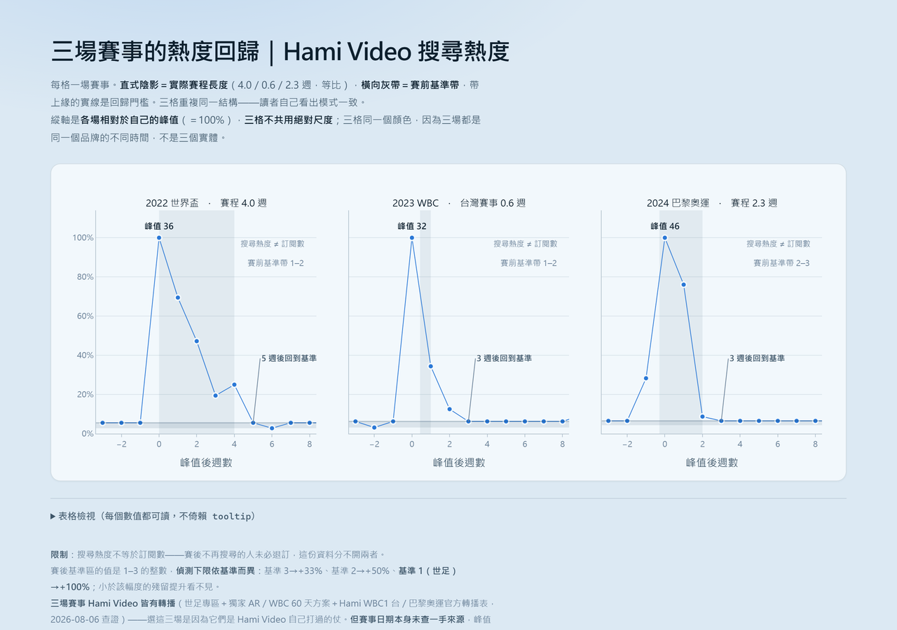
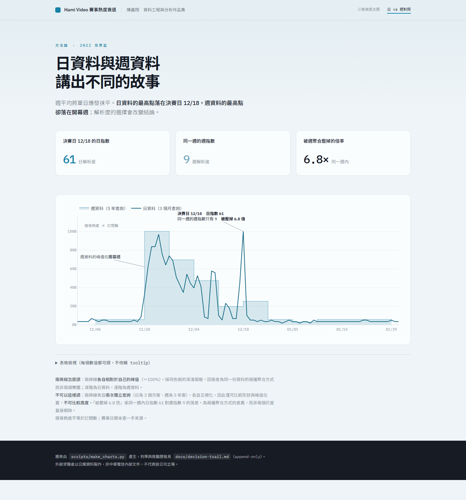

# hamivideo-events

## 賽事帶來的是脈衝，不是階梯。

三場國際賽事之後，Hami Video（中華電信影視平台）的搜尋熱度都在**賽後 1–2 週內回到賽前基準**，
三場皆然。在這份資料的解析度下，觀測不到任何殘留提升。



<sup>**▶ [開啟線上圖表](https://raymond-chen-das.github.io/hamivideo-events/)**
（互動版）。與 [`charts/decay-by-event.html`](charts/decay-by-event.html) 同一頁，可離線開啟。</sup>

**快速摘要頁**：[`charts/onepager.html`](charts/onepager.html)。
頁上每個數值都在產生時從快照重新計算，並與交付規格公布的數字對帳——對不上就中止。

## 這是什麼

如果賽事永久拉高了關注度，曲線會停在一個較高的新水準，那是**階梯**。它沒有。
它衝上去然後掉回來，那是**脈衝**。這就是全部的結果，而且三場都成立。

三場之間衰退**形狀**的差異，幾乎完全是賽程長度的機械後果。值得注意的是它們的收斂，不是分歧。

**唯一的外部參照。** 中華電信官方新聞稿（2023-03-24）公布 WBC 期間 Hami Video
訂閱數較去年同期成長 **11.2 倍**；本分析單以搜尋熱度算出的 WBC 爆發倍率是 **16.0×**。
⚠️ **兩者是不同的量**——官方是訂閱數 YoY，這裡是峰值 ÷ 賽前基準中位數——
**不可直接比較，也不宣稱吻合**。可以說的是量級相近，構成「搜尋熱度追蹤到某個真實東西」的
弱外部證據。這是目前唯一能為下方限制第 1 條提供外部參照的資料點。

## 原始資料的取得

**原始快照不隨本 repo 散布。** `data/raw/*.csv` 由 `pytrends` 取得，
而它連的是 Google Trends 的非官方端點。Google 的服務條款是否允許再散布取回的序列，
我沒有查證過，所以選擇排除，而不是假設沒問題。

讀懂這個專案不需要它們。圖表、摘要與本文所有數字都是已提交的靜態產物：

| 不需要原始資料就能看的東西 | |
|---|---|
| [`charts/decay-by-event.html`](charts/decay-by-event.html) | 主圖 |
| [`charts/daily-vs-weekly.html`](charts/daily-vs-weekly.html) | 方法圖 |
| [`charts/onepager.html`](charts/onepager.html) | 摘要 |
| 本 README | 全部結果數字 |

要重新取得快照，`scripts/fetch_day1.py` 會重跑採集。動手前先知道這件事：
**配額是觸發式封鎖，不是每分鐘節流**——實測踩線後 0/30 橫跨 47.5 小時，
退避與閒置冷卻皆無效。**不要迴圈重試。** 取數腳本一律 fail-fast：
第一個 429 就中止當天所有請求，每次嘗試都寫進
[`logs/quota_attempts.csv`](logs/quota_attempts.csv)。

每一支讀取快照的腳本都經過 `scripts/_data.py`，缺檔時會**明確指出缺哪個檔、怎麼重生**，
而不是丟一個裸的 `FileNotFoundError`。唯一需要真實資料的測試會 skip 並說明理由，
其餘 13 項照跑。

採集時間戳（`data/raw/run1_timestamp.txt`）**有**進版控——它是來源紀錄，不是資料。

## 方法

**訊號。** Google Trends，地區 `TW`，關鍵字 `Hami Video`，週解析度，
2021-08-01 → 2026-07-26（n = 261 週）。五個品牌關鍵字一次查詢，
所以三場賽事共用同一個正規化尺度、可直接相互比較——這也是主線用週而非日的原因。

**看資料前登記的量。**

| 量 | 定義 |
|---|---|
| 峰值週 | 賽事窗前後各 2 週內的最高週值 |
| 賽前基準帶 | 峰值前第 26 至第 6 週的 p25–p75 |
| 爆發倍率 | 峰值 ÷ 基準中位數 |
| 回到基準的週數 | 峰值後首次落回帶上緣（p75）所需的週數 |

用分位數而非 min–max：WBC 的基準窗仍與世界盃重疊（max = 36），
min–max 會把基準帶撐成無意義的寬帶。原本 8 週的定義也被同樣的方式污染；
修正版**明確標示為事後修正**——**預先登記的原始數字保留不刪**：
WBC 的回歸週數由 1 週改為 3 週，世界盃與奧運不變。

**日級解析度的交叉檢查。** 其中一個事件窗另外以日解析度取得（2022-11-01 → 2023-01-31）。
它顯示週聚合會抹掉單日爆發：世界盃決賽日（2022-12-18）日指數 **61**，
而包含該日的那一週只有 **9**。所以週級把峰值判在**開幕週**，日級判在**決賽日**。
兩張圖都交付——這個分歧本身就是結果。

## 如何重跑

需要 Python 3.13。不需要網路——圖表與摘要在有快照時可重建，沒有快照時已提交的產物本身就成立。

```bash
py -3.13 -m venv .venv
.\.venv\Scripts\python.exe -m pip install -r requirements.txt

pytest -q                                    # 14 項測試，蓋住結論所依賴的量
python scripts/analysis_weekly_main.py       # 主線結果：下方表格
python scripts/analysis_daily_vs_weekly.py   # 週級抹平查核＋基準窗修正
python scripts/analysis_alignment.py         # 峰值對齊 vs 賽事結束對齊
python scripts/make_charts.py                # 重新產生圖表（產生時即斷言）
python scripts/verify_charts.py              # 驗證寫出的 HTML，不是記憶體裡的物件
python scripts/build_onepager.py             # 摘要頁
```

`scripts/metrics.py` 收著結論所依賴的四個量（`half_life`、`spike_ratio`、
`periods_to_threshold`、`baseline_band`）。它們有測試，因為每一個都有**會改變答案卻不會報錯**
的路徑：永遠回不到一半的半衰期回傳 `None`（不是 0，也不是「很快」），
中位數為 0 時的尖峰比回傳 `inf`。其中一項測試刻意釘住基準帶的**崩潰點**——
污染超過約四分之一時，p25–p75 這個窗就不再穩健，所以該定義對間隔更近的賽事並非無條件安全。

`scripts/fetch_day*.py` 會打 Google Trends API 並**消耗配額**。

`verify_charts.py` 解析產生出的 HTML，檢查 shape 幾何、三種容器寬度下的標註碰撞、
超出繪圖區、**標註是否被資料線穿過**，以及註記是否指涉不存在的元素。
每一項檢查的存在都是因為曾經有一個沉默的失敗溜過去：
`add_vrect`／`add_hline` 的 `exclude_empty_subplots` 預設為 True，
會把加在還沒有 trace 的 subplot 上的 shape 丟掉——不報錯、不警告；
而「標註 vs 資料線」這一項，是在渲染截圖顯示免責小字被三格的陡升段整個穿過、
而驗證器卻回報無碰撞之後才補上的。

## 驗證路徑

驗證器通過不代表圖是對的——只代表它通過了當時存在的那些檢查。

建置過程中出現過同一型的問題：檢查宣稱的嚴謹度高於它實際做到的。
一個實例：標註與資料線的碰撞檢查在 autorange 生效時靜默失效——
它讀不到還沒定案的軸範圍，於是整段跳過而不報錯。
**這類問題都是在把產出擺到人眼前的那一刻才浮現。**

由此得到的規則是：**任何進入交付物的數字或畫面，都需要一條獨立於產生它的程式碼的驗證管道**——
渲染截圖、已知會失敗的輸入、校驗碼。

## 結果

| 賽事 | 賽程 | 峰值 | 爆發倍率 | 賽前基準帶 | 回到基準 |
|---|---|---|---|---|---|
| 2022 FIFA 世界盃 | 4.0 週 | 36 | 36.0× | 1–2 | 5 週 |
| 2023 WBC（台灣賽事） | 0.6 週 | 32 | 16.0× | 1–2 | 3 週 |
| 2024 巴黎奧運 | 2.3 週 | 46 | 23.0× | 2–3 | 3 週 |

正規化衰退（峰值 = 1.000）：

| 峰值後週數 | 0 | 1 | 2 | 3 | 4 | 5 |
|---|---|---|---|---|---|---|
| 世界盃 | 1.000 | 0.694 | 0.472 | 0.194 | 0.250 | 0.056 |
| WBC | 1.000 | 0.344 | 0.125 | 0.062 | 0.062 | 0.062 |
| 巴黎奧運 | 1.000 | 0.761 | 0.087 | 0.065 | 0.065 | 0.065 |

方法圖——同一場賽事，兩種解析度，兩個不同的答案：



<sup>互動版：[`charts/daily-vs-weekly.html`](charts/daily-vs-weekly.html)。
兩條線各自對自己的峰值正規化，所以只能比形狀與峰值位置，不能比高度。</sup>

顏色只編碼實體，不編碼排名。主圖三格用同一個藍，因為三場賽事是同一個品牌的不同時間，
不是三個不同的東西。方法圖用同色相的兩個明度階，因為週與日是同一份序列的兩種聚合——
深＝日、淺＝週，明度差本身就是要講的那件事。

## 限制

1. **搜尋熱度不是訂閱數。** 一個人可能在賽事期間訂閱、從未退訂，只是不再搜尋。
   「不再搜尋」與「退訂」是兩件事，這份資料分不開。這是本結果最可能被誤讀的地方。
2. **偵測下限取決於基準值，不是單一數字。** 基準區的週值是 1–3 的整數，
   所以最小可見的提升是：基準 3 → **+33%**、基準 2 → **+50%**、
   基準 1（世界盃）→ **+100%**。小於該幅度就看不見。按事件分別標示，不寫成單一數字。
3. **n = 3，且賽事類型與賽程長度完全混淆。** WBC 掉得最快——可能因為棒球熱度短，
   也可能只是台灣賽事只有一週。這份資料分不開兩者，所以所有結論都是描述性的，不是因果的。
4. **採集不可重現，變異幅度未量化。** 每一次 Google Trends 查詢都是重新抽樣＋重新正規化，
   歷史值**不是**定型的。`data/raw/` 的快照是用來凍結一個不穩定的來源——
   那正是它存在的理由，不是在宣稱來源穩定。可重現性測試被配額擋下（見下）。
5. **峰值與賽事的對應是日期對齊，不是驗證過的歸因**，賽事日期本身也未查一手來源。
   轉播權**已**查證（2026-08-06）：三場 Hami Video 皆有轉播——世足賽專區與獨家 AR、
   WBC 60 天方案與 Hami WBC1 台、巴黎奧運官方轉播表。所以這三場確實是這個平台打過的仗；
   仍未驗證的是確切日期，以及某個峰值與某場比賽之間的因果連結。
6. **只有世界盃窗取到日級資料。** WBC 與奧運窗從未取得。

**為什麼有幾項檢查缺席。** Google Trends 的速率限制是觸發式封鎖，不是每分鐘節流：
前 14 分鐘成功率 41%，接著 0/30 橫跨 47.5 小時，退避與閒置冷卻皆無效。
四項預定的驗證（可重現性、`中華電信 MOD` 對照組、事件關鍵字、兩個缺少的日級窗）尚未執行。
每一項都問過「不補就不能交付嗎」——答案都是不會阻斷。
完整的嘗試紀錄在 [`logs/quota_attempts.csv`](logs/quota_attempts.csv)。

## 目錄

```
data/raw/     Google Trends 快照（不隨版控散布）＋ 採集時間戳
logs/         每一次 API 嘗試的 append-only 紀錄，成功與失敗都記
scripts/      分析、圖表產生、驗證，以及（會消耗配額的）取數
tests/        針對 scripts/metrics.py 的 pytest，含一項真實資料回歸鎖
charts/       兩張圖表與摘要頁；plotly.min.js 隨附以便離線開啟
docs/         內嵌於 README 的渲染截圖（見 docs/images/）
docs/images/  上方內嵌的渲染截圖
```
